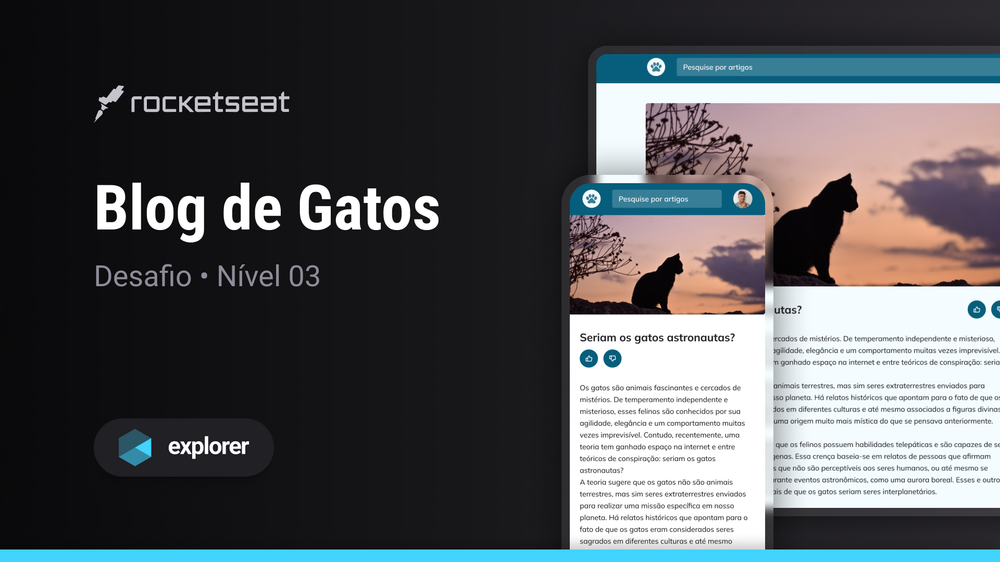

<h1 align="center"> Explorando Gatos </h1>

  Projeto simples desenvolvido para estudar HTML e CSS, com foco no estudo do Grid CSS e responsividade para telas móveis e desktop, e informações sobre gatos.

  <a href="#-tecnologias">Tecnologias</a>&nbsp;&nbsp;&nbsp;|&nbsp;&nbsp;&nbsp;
  <a href="#-projeto">Projeto</a>&nbsp;&nbsp;&nbsp;|&nbsp;&nbsp;&nbsp;
  <a href="#-layout">Layout</a>&nbsp;&nbsp;&nbsp;|&nbsp;&nbsp;&nbsp;
  <a href="#memo-licença">Licença</a> 

  

 

  

## 🚀 Tecnologias

Esse projeto foi desenvolvido com as seguintes tecnologias:

- HTML
- CSS

## 💻 Projeto

O projeto consiste em compartilhar informações interessantes sobre gatos, oferecendo uma experiência simples e educativa. Ideal para iniciantes que estão estudando HTML e CSS, com foco no estudo do Grid CSS e responsividade para telas móveis e desktop.

- [Acesse o Projeto online](https://guedescss.github.io/catblog-stage3/)

Feito by GuedesCSS :wave:
